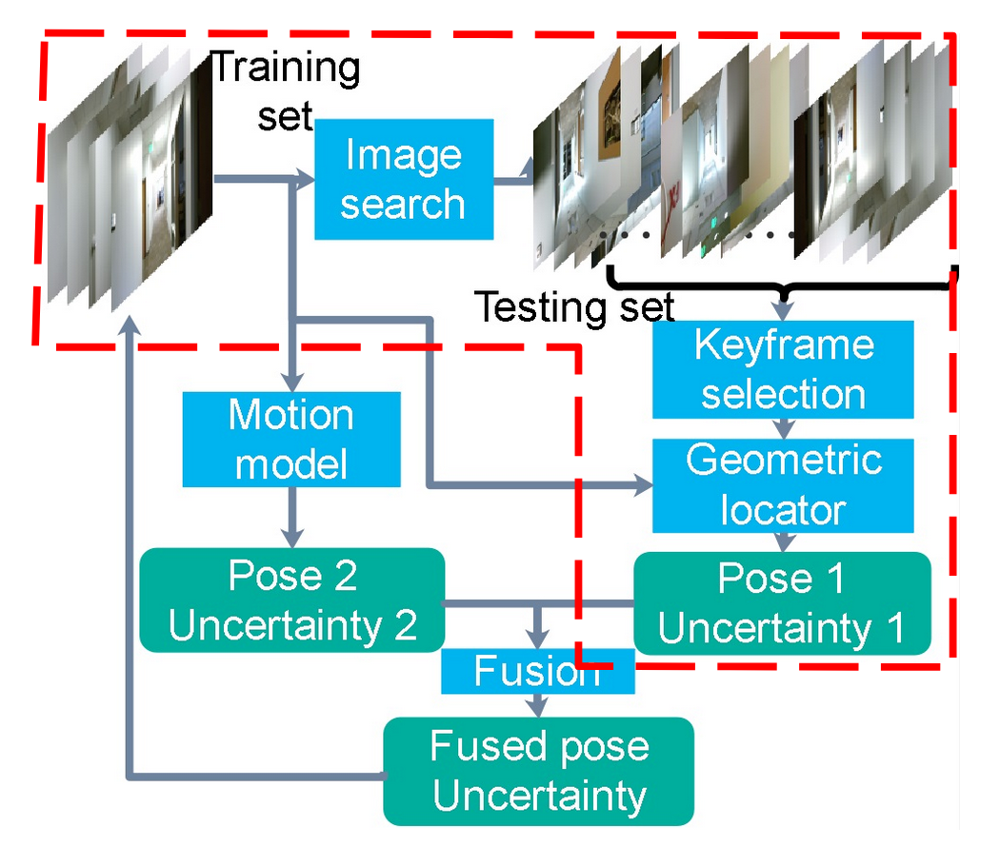
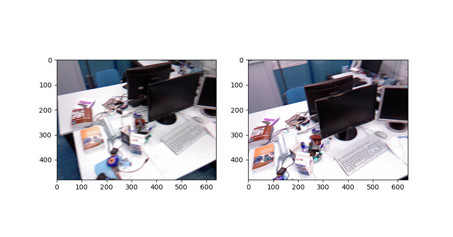
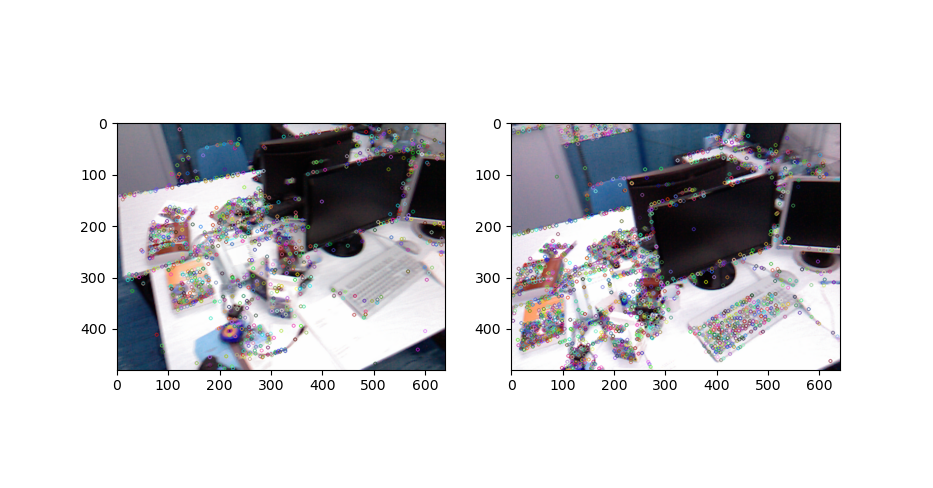
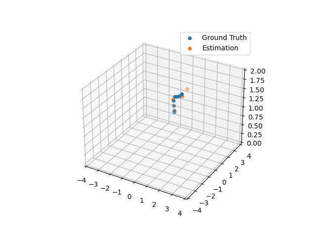

# Image-based Indoor Localization
This project is a faithful Tensorflow implementation of the paper. The code is based on the authors' original implementation and has been tested to match it numerically.

Here is the link to the original [paper](https://arxiv.org/abs/2201.01408)

## Table of Contents
- [Image-based Indoor Localization](#image-based-indoor-localization)
  - [Table of Contents](#table-of-contents)
  - [Background](#background)
  - [Installation](#installation)
  - [Download Dataset](#download-dataset)
  - [How to Run?](#how-to-run)
  - [Some of the Results](#some-of-the-results)
    - [Keypoint matching](#keypoint-matching)
    - [Triangulation](#triangulation)
    - [Final estimation](#final-estimation)
  - [Authors](#authors)


## Background
This paper proposes a new image-based localization framework that explicitly localizes the camera/robot by fusing Convolutional Neural Network (CNN) and sequential images' geometric constraints. The camera is localized using a single or few observed images and training images with 6-degree-of-freedom pose labels. A Siamese network structure is adopted to train an image descriptor network, and the visually similar candidate image in the training set is retrieved to localize the testing image geometrically. Meanwhile, a probabilistic motion model predicts the pose based on a constant velocity assumption. The two estimated poses are finally fused using their uncertainties to yield an accurate pose prediction. This method leverages the geometric uncertainty and is applicable in indoor scenarios predominated by diffuse illumination. Experiments on simulation and real data sets demonstrate the efficiency of our proposed method. The results further show that combining the CNN-based framework with geometric constraint achieves better accuracy when compared with CNN-only methods, especially when the training data size is small.


## Installation
```
git clone https://github.com/Wuao652/SfM-demo.git
cd SfM-demo
```
For running this package, you need the following dependences,
```
numpy
scipy
h5py
matplotlib
opencv-contrib-python
```

## Download Dataset
Currently this package can only handle the TUM dataset `1_desk2` subset, you can download the data [here](https://vision.in.tum.de/data/datasets/rgbd-dataset/download#freiburg1_desk2).
Once you donwload the dataset, you have to put it under the folder `data/TUM/1_desk2`. If you don't have such a folder, just make a new one by your self!


## How to Run?
After installing all the depedences and download the dataset, you can just run
```
python SfM.py
```

## Some of the Results
### General framework

### Keypoint matching



### Triangulation

### Final estimation


## Authors
Wuao Liu, Man Yuan, Wan-Yi Yu, Sairub Naaz, Tamaira Linares
